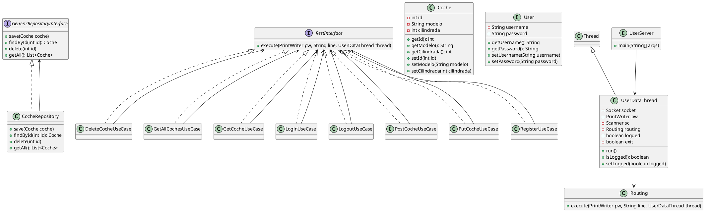

```plantuml
@startuml

interface GenericRepositoryInterface {
    +save(Coche coche)
    +findById(int id): Coche
    +delete(int id)
    +getAll(): List<Coche>
}

interface RestInterface {
    +execute(PrintWriter pw, String line, UserDataThread thread)
}

class Coche {
    -int id
    -String modelo
    -int cilindrada
    +getId(): int
    +getModelo(): String
    +getCilindrada(): int
    +setId(int id)
    +setModelo(String modelo)
    +setCilindrada(int cilindrada)
}

class User {
    -String username
    -String password
    +getUsername(): String
    +getPassword(): String
    +setUsername(String username)
    +setPassword(String password)
}

class CocheRepository implements GenericRepositoryInterface {
    +save(Coche coche)
    +findById(int id): Coche
    +delete(int id)
    +getAll(): List<Coche>
}

class Routing {
    +execute(PrintWriter pw, String line, UserDataThread thread)
}

class UserDataThread extends Thread {
    -Socket socket
    -PrintWriter pw
    -Scanner sc
    -Routing routing
    -boolean logged
    -boolean exit
    +run()
    +isLogged(): boolean
    +setLogged(boolean logged)
}

class UserServer {
    +main(String[] args)
}

class DeleteCocheUseCase implements RestInterface
class GetAllCochesUseCase implements RestInterface
class GetCocheUseCase implements RestInterface
class LoginUseCase implements RestInterface
class LogoutUseCase implements RestInterface
class PostCocheUseCase implements RestInterface
class PutCocheUseCase implements RestInterface
class RegisterUseCase implements RestInterface

CocheRepository --> GenericRepositoryInterface
DeleteCocheUseCase --> RestInterface
GetAllCochesUseCase --> RestInterface
GetCocheUseCase --> RestInterface
LoginUseCase --> RestInterface
LogoutUseCase --> RestInterface
PostCocheUseCase --> RestInterface
PutCocheUseCase --> RestInterface
RegisterUseCase --> RestInterface
UserDataThread --> Routing
UserServer --> UserDataThread

@enduml

```